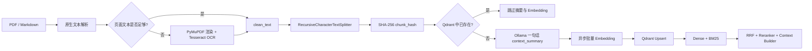

# AWS Support Knowledge Base Ingestion Pipeline

一条面向生产环境的 PDF/Markdown → 清洗 → OCR 兜底 → 递归切片 → LLM 上下文增强 →
异步 Embedding → Qdrant 幂等写入流水线，并附带 Dense + BM25 + RRF 混合检索、重排和
Ragas 黄金集评测。

> `data/sample` 是可公开复现的合成 AWS 支持文档，不是 AWS 官方文档。生产环境应替换为
> 经批准的数据源。

## 架构



关键保证：

- PDF 每页先用 `pypdf` 抽取；文本低于阈值时自动用 PyMuPDF 以 300 DPI 渲染并调用
  Tesseract。单页 OCR 失败只记 WARNING，不中断其他页或文件。
- 使用 LangChain `RecursiveCharacterTextSplitter`，分隔符按段落、行、句子、词逐级回退；
  没有固定宽度硬切逻辑。
- 每个 Chunk 强制包含 `source_file`、`page_number`、文本 SHA-256 `chunk_hash` 和一句话
  `context_summary`。LLM 暂时不可用时记录 `summary_fallback=true` 并注入抽取式兜底摘要。
- `chunk_hash` 库内查询发生在摘要和 Embedding 之前；重复运行不会产生重复向量，也不会
  重复产生模型费用。
- 摘要与 Embedding 都是异步、有限并发、批量处理；所有核心函数有类型提示，生产路径只用
  `logging`，没有 `print()`。

## 快速开始

核心流水线需要 Python 3.11+。Windows 上运行完整 Ragas 评测推荐 Python 3.12；更新的
Python 版本可能因 `scikit-network` 暂无对应预编译 wheel 而要求本机安装 C++ 编译工具。
Ollama 是默认的免费本地模型服务；OCR 还需要操作系统中已安装
[Tesseract](https://github.com/tesseract-ocr/tesseract)。

```bash
python -m venv .venv
# Windows: .venv\Scripts\activate
# macOS/Linux: source .venv/bin/activate
pip install -e ".[dev,eval]"

ollama pull llama3.2:3b
ollama pull nomic-embed-text
cp .env.example .env
python main.py data/sample
```

离线/CI 冒烟运行可使用确定性的特征哈希向量和抽取式摘要；它用于复现测试，不建议替代生产
语义模型：

```bash
python main.py data/sample --summary-provider extractive --embedding-provider hash
```

常用环境变量见 [.env.example](.env.example)。若使用远程 Qdrant，可直接实例化
`QdrantVectorStore(url=..., api_key=...)`；默认使用 `.rag_data/qdrant` 本地持久化模式。

## 测试与黄金集评测

```bash
pytest
python evals/evaluate_retriever.py \
  --data-dir data/my_docs \
  --golden evals/my_docs_golden_dataset.json \
  --output evals/my_docs_results.json \
  --chunk-sizes 256 512 \
  --top-k 3
```

合成评测语料位于 `data/my_docs/aws_support_synthetic.md`，配套黄金集位于
`evals/my_docs_golden_dataset.json`，包含 5 个 `Question / Ground Truth / Reference
Evidence` 对，覆盖 S3、EC2、Lambda、RDS Proxy 和 CloudFront。评测先完整运行 ingestion，
再执行混合召回；随后用 Ragas
`IDBasedContextRecall` 比较召回的 `chunk_hash` 和证据所在 Chunk 的哈希，无需付费 API 或
LLM-as-a-judge。明细写入 `evals/my_docs_results.json`。

| Chunk Size | Overlap | Chunk 数 | Ragas Context Recall@3 | 说明 |
|---:|---:|---:|---:|---|
| 256 | 32 | 17 | 1.00 | 五题所需证据均在 Recall@3 中命中 |
| 512 | 64 | 8 | 1.00 | 保持完整召回，同时显著减少向量数量 |

生产默认推荐 **512 字符 + 64 字符 overlap**：两种参数的 Recall@3 均为 1.00，但 512 将向量数
从 17 降至 8，减少约 53% 的首次 Embedding、索引存储和摘要请求。AWS 故障排查步骤经常需要
同一段中的“症状、原因、操作”共同出现，512 也更不容易拆散条件与结论。若真实语料以短 FAQ
为主，应以自己的黄金集重新选择参数，而不是照搬默认值。

### 混合格式压力测试

`data/aws_support_test_corpus` 是另一套合成集成测试语料，包含 Markdown、双页文本 PDF、双页
扫描 PDF、空 Markdown 和故意损坏的 PDF。Windows 上安装 Tesseract 后可运行完整 OCR 与
Ragas 验证：

```powershell
$env:Path = "C:\Program Files\Tesseract-OCR;" + $env:Path

.\.venv312\Scripts\python.exe evals\evaluate_retriever.py `
  --data-dir data\aws_support_test_corpus\data `
  --golden evals\aws_support_test_corpus_golden.json `
  --database-root .rag_data\corpus-eval `
  --output evals\aws_support_test_corpus_results.json `
  --chunk-sizes 256 512 `
  --top-k 3
```

集成验证结果：4 个有效文档成功解析，空文件和损坏 PDF 被安全跳过；扫描 PDF 的两页触发 OCR。
首次运行写入 28 个 512-size Chunk，第二次运行全部按 `chunk_hash` 跳过。每个 Chunk 均包含
`source_file`、`page_number`、`chunk_hash` 和 `context_summary`。

| Chunk Size | Overlap | Chunk 数 | Ragas Context Recall@3 |
|---:|---:|---:|---:|
| 256 | 32 | 59 | 0.50 |
| 512 | 64 | 28 | 0.40 |

该压力测试使用确定性的 Hash Embedding，因此分数用于离线回归，不代表生产语义检索质量。256
在此语料上召回更高，但向量数约为 512 的两倍；上线前应改用 Ollama 或生产 Embedding 模型，
再以真实支持问题重新评测参数。

## 目录

```text
.
├── main.py                       # 作业要求的主入口
├── utils.py                      # 作业要求的解析/清洗兼容入口
├── test_pipeline.py              # 作业要求的两项核心单测
├── src/rag/
│   ├── ingestion/                # 解析、OCR、切片、摘要、Embedding、Qdrant
│   ├── retrieval/                # dense、BM25、filter、RRF、reranker、context
│   ├── generation/               # prompts 与 Ollama generator
│   └── api/                      # 可选 FastAPI route factory
├── tests/                        # 检索、重排、上下文、幂等测试
├── evals/                        # 5 题黄金集与 Ragas 脚本
├── data/sample/                  # 合成可复现数据
└── pyproject.toml
```

## 生产注意事项

- Tesseract 是独立系统程序；容器镜像中应固定它和语言包的版本。`OCR_LANGUAGES` 可设为
  `eng+chi_sim`，`TESSERACT_CMD` 可显式指向可执行文件。
- 默认 Ollama API 没有鉴权。跨主机部署时应置于私网并通过带 TLS/鉴权的网关访问。
- 本地 Qdrant 适合单机开发；多副本生产环境应使用 Qdrant Server/Cloud，并配置备份、TLS、
  API key、索引监控和磁盘水位告警。
- 当前 BM25 索引在进程启动时从 payload 重建，适合中小型知识库。大规模部署应换成 OpenSearch
  或 Qdrant 原生 sparse vectors，同时保留 `Retriever` 接口和 RRF 层。
- 修改 embedding 模型会改变向量维度和空间，应写入新的 collection 并完成离线验证后原子切换，
  不要把不同模型的向量写入同一 collection。
