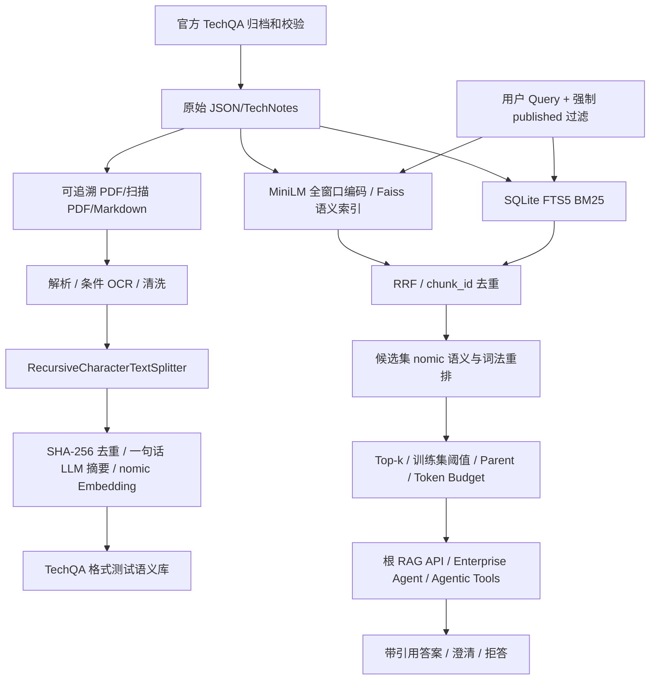

# IBM TechQA Ingestion、Retrieval 与 Agent

三个作业项目共用 [IBM TechQA](https://github.com/ibm/techqa) 官方数据。当前入口、演示、黄金集和实验不再读取 AWS 合成知识库。历史 AWS 结果仅保留在 `audit/2026-09-29` 审计记录与 Git 历史中。

## 数据范围与来源

| 用途 | 数据范围 |
|---|---|
| 三个服务的默认查询 | 全量 TechNote 文档；MiniLM/Faiss 语义 Dense + 磁盘 BM25 + 有限候选语义重排 |
| 全量源文件 | 801,998 条；2 条正文为空；801,996 篇有效且不重复的文档 |
| 全量检索对比 | 官方 dev 310 题，另跑 validation 20 题 |
| 阈值校准 | 语义版本使用官方 training 全部 600 题；不使用 dev 标签调参 |
| PDF/Markdown/OCR 与 Ragas | 原始训练题与原文转换的格式测试文件；不是全量文档格式测试 |
| 离线单元测试 | 41 篇官方文档、15 条原始训练题；故障测试另用空输入、坏文件和模型替身 |
| Planner/ReAct/Critic/Single/Multi | 同一全量库上的 15 条官方训练题；真实 Ollama |

下载来源是官方仓库指向的 PrimeQA/TechQA 归档，SHA-256：
`6b094ef9a69718f727ce8d7e15c4d961e51032cefaa952e0d6af9d176d7ba118`。
原始数据遵循 CDLA-Permissive-1.0；许可、文档 ID、原文 SHA-256 和选样规则在
[data/techqa](data/techqa/manifest.json)。Markdown 是标题与原文；PDF 与扫描 PDF 是该原文的格式转换，未编造支持内容。

TechQA 的 `ANSWERABLE=N` 表示其官方 `DOC_IDS` 候选文档中没有标注答案。当前全库检索实验不限定 `DOC_IDS`，因此“拒答准确率”是对这些标签的代理测量，不能据此断言整个 80 万文档库没有答案。validation 有与 dev 重复的问题，不是新的独立留出集。

## 架构和数据流


```mermaid
flowchart TD
    A[官方 TechQA 归档和校验] --> B[原始 JSON/TechNotes]
    B --> C[MiniLM 全窗口编码 / Faiss 语义索引]
    B --> D[SQLite FTS5 BM25]
    B --> E[可追溯 PDF/扫描 PDF/Markdown]
    E --> F[解析 / 条件 OCR / 清洗]
    F --> G[RecursiveCharacterTextSplitter]
    G --> H[SHA-256 去重 / 一句话 LLM 摘要 / nomic Embedding]
    H --> I[TechQA 格式测试语义库]
    Q[用户 Query + 强制 published 过滤] --> C
    Q --> D
    C --> J[RRF / chunk_id 去重]
    D --> J
    J --> K[候选集 nomic 语义与词法重排]
    K --> L[Top-k / 训练集阈值 / Parent / Token Budget]
    L --> M[根 RAG API / Enterprise Agent / Agentic Tools]
    M --> N[带引用答案 / 澄清 / 拒答]
```

`src/rag/techqa` 是三个项目共享的数据与检索实现。默认 Dense 使用固定版本
`sentence-transformers/all-MiniLM-L6-v2` 的 384 维真实语义向量，Faiss 精确余弦搜索与 SQLite 元数据
通过本地 11435 端口提供服务。长 Chunk 按 256 Token 窗口编码后聚合，保留所有窗口，避免静默截断。
构建支持断点恢复与 SHA-256 向量复用，仅在全文档覆盖、向量有效性和数量检查通过后发布完成标记。
旧 Qdrant Hash 索引仅在明确设置 `TECHQA_DENSE_BACKEND=hash` 时作为历史基线使用。
PDF/Markdown 格式测试库继续使用 768 维 nomic；两个语义库的评测范围分别记录。

Dense/Sparse 并行 `asyncio.gather()`，手写 RRF：`score(d) = Σ 1 / (60 + rank(d))`，按同一个
`chunk_id` 去重，仅融合完成后调用一次 Reranker。全量 Sparse 复用已有 Qdrant 切片身份，保持兼容；
新 PDF/Markdown ingestion 使用 `RecursiveCharacterTextSplitter`。FTS 查询先取 Top-k 行号再读取正文，
避免对大量全文结果逐一做文档表联接。

默认 `candidate_k=30, rerank_k=20, final_k=5`，最多 8000 Context Tokens，每文档最多两块。
该配置限制模型调用、上下文大小与延迟；小样本不足以证明它是全局最优参数。
`source_file/document_type/language` 支持过滤；系统注入 `status=published`，用户不可覆盖。
候选为空不调用重排/LLM，最终上下文为空或低于校准阈值拒答。引用不在本次 source_map 中则重试一次，仍错误就拒答。
重排超时会保留原始排序，并用单独的词项覆盖率门控，不能拿 RRF 分数与语义重排阈值比较。

## 安装与运行

客户端使用 Python 3.11+；完整语义编码与 Ragas 建议使用 Python 3.12。
安装 Ollama，以及扫描 PDF 所需 Tesseract。默认全量语义服务不需要 Docker；Hash 基线使用 Docker/Qdrant。
从仓库根目录执行：

```powershell
py -3.12 -m venv .venv312
.venv312/Scripts/Activate.ps1
python -m pip install -e ".[dev,api,eval,semantic]"
Copy-Item .env.example .env
./scripts/start-local.ps1  # 准备 Ollama 模型；全量索引完成后再加 -FullTechQA
```

已提交的官方小样本无需下载即可做格式流程和离线测试：

```powershell
python main.py
python main.py  # 幂等复跑，已存在 Chunk 不调用摘要或 Embedding
python scripts/test_all.py
python evals/evaluate_retriever.py --output evals/techqa_ragas_results.json
python evals/evaluate_retrieval_modes.py --database .rag_data/qdrant `
  --collection techqa_nomic_v3 --embedding-provider ollama --include-fallback `
  --output evals/techqa_fixture_retrieval.json
```

全量库首次准备（原始文件和索引不提交 Git）：

```powershell
./scripts/prepare-techqa.ps1
python scripts/verify_techqa_source.py
./scripts/start-local.ps1 -FullTechQA
```

具体全量获取命令见 [Enterprise README](enterprise-ai-agent/README.md)。
完整构建需要下载官方归档和模型，并编码 801,996 篇文档。CUDA 环境可先安装
`torch==2.8.0` 的 cu126 版本，参考 [PyTorch 官方安装说明](https://pytorch.org/get-started/previous-versions/)；
CPU 也可运行但较慢。`python scripts/verify_semantic_fixture.py` 用提交的 41 篇官方原文验证真实编码、
幂等重建、来源身份和过滤。构建未完成时语义服务返回不可用，Hybrid 的降级会明确写日志。
`.env.example` 配置全量服务；主 ingestion CLI 默认处理 `data/techqa/mixed`，写入独立的
`techqa_nomic_v3` 集合。设置 `RAG_BACKEND=local` 可将根 API 指向该格式测试语义库；默认
`RAG_BACKEND=techqa` 查询全量库。不能把格式测试库与全量库的结果混为一谈。

启动服务（从各自目录运行）：

```powershell
# 根项目，8000
rag-api
# enterprise-ai-agent，8001
python -m uvicorn api.main:app --host 127.0.0.1 --port 8001
# agentic-rag-homework，8002；默认 MODEL_PROVIDER=ollama
python -m uvicorn api.main:app --host 127.0.0.1 --port 8002
```

所有项目先安装根项目的共享包 `pip install -e ..`（从子项目目录）。不要同时安装两个具有同名
`models/api/agents` 包的子项目到同一环境；`scripts/test_all.py` 按独立工作目录启动测试进程。

## 接口

根 API：`POST /v1/rag/query`。请求中的 `mode` 可以是 dense/sparse/hybrid。

```json
{"query":"User environment variables no longer getting picked up after upgrade to 4.1.1.1 or 4.1.1.2?", "mode":"hybrid", "filters":{"language":"en","document_type":"ibm_technote"}}
```

真实完整回答、拒答及六种 Agent 端点的请求/响应在 [HTTP 实跑记录](evals/techqa_semantic_api_smoke.json)。
例如 Streams 问题应引用 `techqa://swg21996508`，解释 `streamtool setproperty`；
`language=zh-CN` 无匹配文档时直接拒答。

## 评测与验收

```powershell
python -m rag.techqa.evaluate --split train --output evals/techqa_semantic_calibration
python -m rag.techqa.calibrate
python -m rag.techqa.evaluate --split dev --output evals/techqa_semantic_full
python -m rag.techqa.evaluate --split validation --output evals/techqa_semantic_validation
python scripts/smoke_techqa.py --output evals/techqa_semantic_api_smoke.json
```

- [全量语义检索对比](evals/techqa_semantic_full/summary.json)：Dense、Dense+Rerank、BM25、Hybrid+Rerank；逐题记录 `runs.jsonl`。
- [Ragas](evals/techqa_ragas_results.json)：5 条官方训练题，256/512 两种切片，IDBasedContextRecall，独立记录格式小样本范围。
- [格式测试库的 15 题检索与故障注入](evals/techqa_fixture_retrieval.json)。
- [真实 Agent 实验](agentic-rag-homework/evaluation/results/techqa_semantic/report.md)。
- [本轮语义与 Agent 复验](audit/2026-10-02-semantic-agent.md)。
- [完整迁移复验报告](audit/2026-09-30-techqa.md)：最终数值、边界、失败案例和复现命令。

完整的三项目语义版本验收可运行 `./scripts/run-semantic-acceptance.ps1 -Resume`，依次执行训练集校准、
dev/validation 检索对比、Enterprise 310 题、Agentic 实验、真实 HTTP 与回归测试。
Enterprise 新增适用性复核后的运行默认写入 `techqa_semantic_v3`；`techqa_semantic` 保留改进前结果。
`techqa_semantic_v2` 是修复期间中止的部分记录，不能当作完整验收结果。
检查点会拒绝不同代码或模型的续跑，不能把两版结果混在同一份成绩中。
下表是旧 Hash 索引的历史基线；语义版本输出另存 `techqa_semantic*` 目录，避免覆盖历史结果。
检索命中率与运行无异常都不能直接证明生产级问答正确率。

### 2026-10-02 全量语义 Dense

801,996 篇文档、3,089,056 个 Chunk 全部编码。官方 dev 310 题全部完成、执行错误 0；
有答案题为 160 题，采用与历史表相同的文档级 Recall/Precision 定义。

| 检索模式 | Recall@5 | Recall@10 | MRR | Context Precision@5 | 平均检索延迟 ms |
|---|---:|---:|---:|---:|---:|
| Dense（MiniLM） | 0.4938 | 0.5688 | 0.3924 | 0.1275 | 1222 |
| Dense + nomic Rerank | 0.6125 | 0.6313 | 0.4965 | **0.1750** | 2522 |
| BM25 | 0.6375 | 0.6813 | 0.5165 | 0.1275 | 3045 |
| Hybrid + nomic Rerank | **0.6500** | **0.6938** | **0.5497** | 0.1400 | 3428 |

Dense 的 Recall@5 相对旧 Hash 增加 36.25 个百分点；Hybrid 的提升较小，不能把 Dense 改善
等同于所有模式同幅改善。继续推荐 candidate_k=30、rerank_k=20、final_k=5：
Hybrid 在本次开发集取得最高 Recall/MRR，成本限制在有限候选；该配置仍会漏检。
Agent 额外保留最多 10 篇候选文档给证据压缩，避免把最终答案预算直接用作候选预算。
阈值来自全部 600 道训练题；Agent 候选门槛保留训练中观察到的相关候选，由独立证据判定决定回答。
延迟包含缓存及共享桌面负载，不能作为隔离性能基准；Agent 质量另见实际问答实验。

### 2026-09-30 历史 Hash 基线

310 题全部执行，运行错误 0；其中 160 题有标注答案。以标注文档是否出现在前 k 个 Chunk
中计算 Hit@k（每题单个相关文档下的文档级 Recall@k）；MRR 取 Top-10 首次命中的倒数排名。
Context Precision 为 Top-5 中标注文档 Chunk 的比例，不是 LLM 语义判分。

| 检索模式 | Hit@5 | Hit@10 | MRR | Context Precision@5 | 平均检索延迟 ms |
|---|---:|---:|---:|---:|---:|
| Dense（原有 Hash） | 0.1313 | 0.1438 | 0.0965 | 0.0263 | 599 |
| Dense + nomic Rerank | 0.1563 | 0.1688 | 0.1407 | 0.0350 | 2032 |
| BM25 | 0.6375 | 0.6813 | 0.5165 | 0.1275 | 3138 |
| Hybrid + nomic Rerank | **0.6438** | 0.6750 | **0.5471** | 0.1288 | 4215 |

运行时存在其他本地评测任务，且重排向量有缓存；延迟用于复现记录，不能视为隔离的性能基准。
Enterprise 使用同一 Hybrid 检索的 310 题运行错误也为 0，官方 N 标签下拒答比例为 **0.38**。
拒答仍不理想；N 标签候选范围与全库不同，上述比例不是全库无答案判定的真实准确率。
15 题格式测试的各模式拒答率与阈值另见 `evals/techqa_fixture_retrieval.json`。

### Chunk Size 与 Ragas

同一批官方原文格式文件、同一组 5 条官方题，nomic 语义 Embedding、Top-3 召回，
使用 Ragas `IDBasedContextRecall`；参考 Chunk ID 由官方答案原文覆盖映射得到。

| Chunk Size | Overlap | 去重 Chunk 数 | Ragas Context Recall |
|---|---:|---:|---:|
| 256 | 32 | 367 | 0.20 |
| 512 | 64 | 178 | **0.40** |

格式 ingestion 默认推荐 512/64：此 5 题实验中保留更多连续语境、写入数量较少，召回好于 256。
样本太少且分数仍低，不能声称这是全库最优参数或已经达到高质量生产标准。

### 实际 HTTP 回答与拒答

以下为真实运行的完整响应；所有请求/响应还保存在 smoke JSON。

**成功回答请求**

```json
{
  "query": "User environment variables no longer getting picked up after upgrade to 4.1.1.1 or 4.1.1.2?\nHave you found that after upgrade to Streams 4.1.1.1 or 4.1.1.2, that environment variables set in your .bashrc are no longer being set? For example ODBCINI is not set for the database toolkit and you get\n\n     An SQL operation failed. The SQL state is 08003, the SQL code\n     is 0 and the SQL message is [unixODBC][Driver\n     Manager]Connnection does not exist."
}
```

**完整响应**

```json
{
  "answer": "After upgrading to IBM Streams 4.1.1.1 or 4.1.1.2, environment variables set in your .bashrc are no longer being inherited by Streams jobs when Streams is run as a system service. To work around this issue, you need to set the required environment variables directly in the instance using the `streamtool setproperty` command as follows:\n\n```sh\nstreamtool setproperty -d <domain> -i <instance> --application-ev <VARIABLE NAME>=<VARIABLE VALUE>\n```\n\nThis behavior is different from earlier releases and is documented in APAR IT18432 [S2]. The issue has been fixed in IBM Streams Version 4.1.1 Fix Pack 4, 5, and 6, and the problem was concluded to be fixed in 4.1.1.3.\n\nFor more information, you can refer to the APAR [S2].",
  "citations": [
    {
      "source_id": "S2",
      "chunk_id": "techqa:swg1IT18432:parent",
      "source_file": "techqa://swg1IT18432",
      "page_number": 1
    }
  ],
  "retrieval": {
    "mode": "hybrid",
    "dense_candidates": 30,
    "sparse_candidates": 30,
    "reranked_candidates": 20,
    "final_chunks": 2,
    "context_tokens": 601,
    "reranker_fallback": false
  },
  "refused": false,
  "refusal_reason": null
}
```

**无匹配过滤拒答请求**

```json
{
  "query": "User environment variables no longer getting picked up after upgrade to 4.1.1.1 or 4.1.1.2?\nHave you found that after upgrade to Streams 4.1.1.1 or 4.1.1.2, that environment variables set in your .bashrc are no longer being set? For example ODBCINI is not set for the database toolkit and you get\n\n     An SQL operation failed. The SQL state is 08003, the SQL code\n     is 0 and the SQL message is [unixODBC][Driver\n     Manager]Connnection does not exist.",
  "filters": {
    "language": "zh-CN"
  }
}
```

**完整响应**

```json
{
  "answer": "知识库无法回答该问题。",
  "citations": [],
  "retrieval": {
    "mode": "hybrid",
    "dense_candidates": 0,
    "sparse_candidates": 0,
    "reranked_candidates": 0,
    "final_chunks": 0,
    "context_tokens": 0,
    "reranker_fallback": false
  },
  "refused": true,
  "refusal_reason": "no_retrieval_results"
}
```
