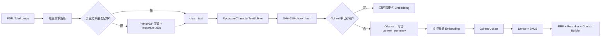
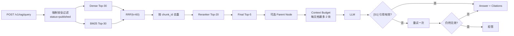

# AWS Support Production RAG Backend

一条面向生产环境的 PDF/Markdown → 清洗 → OCR 兜底 → 递归切片 → LLM 上下文增强 →
异步 Embedding → Qdrant 幂等写入流水线，以及可通过 HTTP 查询的 Dense + BM25 + RRF
混合检索、重排、受限 Context、引用校验和拒答链路。

> `data/sample` 是可公开复现的合成 AWS 支持文档，不是 AWS 官方文档。生产环境应替换为
> 经批准的数据源。

2026-09-30 修复与真实流程复验见 [复验报告](audit/2026-09-29/remediation.md)。
三个项目统一测试：`python scripts/test_all.py`。

## 架构


```mermaid
flowchart LR
    A["PDF / Markdown"] --> B["原生文本解析"]
    B --> C{"页面文本是否足够?"}
    C -- "否" --> D["PyMuPDF 渲染 + Tesseract OCR"]
    C -- "是" --> E["clean_text"]
    D --> E
    E --> F["RecursiveCharacterTextSplitter"]
    F --> G["SHA-256 chunk_hash"]
    G --> H{"Qdrant 中已存在?"}
    H -- "是" --> I["跳过摘要与 Embedding"]
    H -- "否" --> J["Ollama 一句话 context_summary"]
    J --> K["异步批量 Embedding"]
    K --> L["Qdrant Upsert"]
    L --> M["Dense + BM25"]
    M --> N["RRF + Reranker + Context Builder"]
```

关键保证：

- PDF 每页先用 `pypdf` 抽取；文本低于阈值时自动用 PyMuPDF 以 300 DPI 渲染并调用
  Tesseract。单页 OCR 失败只记 WARNING，不中断其他页或文件。
- 使用 LangChain `RecursiveCharacterTextSplitter`，分隔符按段落、行、句子、词逐级回退；
  没有固定宽度硬切逻辑。
- 每个 Chunk 强制包含 `source_file`、`page_number`、文本 SHA-256 `chunk_hash` 和一句话
  `context_summary`。LLM 暂时不可用时记录 `summary_fallback=true` 并注入抽取式兜底摘要。
- `chunk_hash` 库内查询发生在摘要和 Embedding 之前；重复运行不会产生重复向量，也不会
  重复产生模型费用。
- 摘要与 Embedding 都是异步、有限并发、批量处理；所有核心函数有类型提示，生产路径只用
  `logging`，没有 `print()`。

## Retrieval 与 Generation 架构


```mermaid
flowchart LR
    Q["POST /v1/rag/query"] --> SF["强制安全过滤<br/>status=published"]
    SF --> D["Dense Top-30"]
    SF --> S["BM25 Top-30"]
    D --> RRF["RRF(k=60)"]
    S --> RRF
    RRF --> DD["按 chunk_id 去重"]
    DD --> RR["Reranker Top-20"]
    RR --> F["Final Top-5"]
    F --> P["可选 Parent Node"]
    P --> C["Context Budget<br/>每文档最多 2 块"]
    C --> L["LLM"]
    L --> V{"[S1] 引用有效?"}
    V -- "是" --> A["Answer + Citations"]
    V -- "否" --> RT["重试一次"]
    RT --> V2{"仍然无效?"}
    V2 -- "是" --> X["拒答"]
    V2 -- "否" --> A
```

完整数据流为：

```text
PDF/Markdown → Page → Recursive Chunk → chunk_id/chunk_hash → Qdrant
User Query → 强制 Metadata Filter → Dense 与 BM25 并行 → RRF → Reranker
→ Token-budget Context → Ollama → Citation Validation → Answer/Refusal
```

支持 `mode=dense`、`mode=sparse` 和 `mode=hybrid`。用户可过滤 `source_file`、
`document_type`、`language`；`status=published` 由系统强制注入，用户提交
`status=draft` 也不能覆盖。Dense、Sparse 与 Reranker 通过独立接口注入。每个
`SearchResult` 可直接读取并通过 `to_dict()` 返回 `chunk_id`、`text`、`source_file`、
`page_number`、`retrieval_score` 和 `retrieval_rank`；完整 metadata 仍会同时保留。

### RRF 公式

本项目手写 Reciprocal Rank Fusion，而不是调用黑盒框架：

```text
RRF_score(d) = Σ 1 / (k + rank_r(d))
               r∈retrieval_lists
```

生产默认 `k=60`。同一 `chunk_id` 在 Dense 与 BM25 中出现时只保留一次，同时记录
`dense_rank`、`sparse_rank`、`fusion_rank` 和 `retrieval_sources`。Dense 或 BM25
单路异常时记录日志并使用另一路返回。

### Reranker 与降级

项目通过统一的 `BaseReranker` 接口提供两种 Adapter：

- `LexicalReranker`：默认的轻量、可解释离线实现，无需下载模型。
- `CrossEncoderReranker`：基于 `sentence-transformers` 的本地 Cross-encoder，默认模型为
  `cross-encoder/ms-marco-MiniLM-L-6-v2`，适合生产语义精排。

两种 Adapter 都只接收 Retriever/RRF 产生的最多 `candidate_k=30` 个候选，并同时使用
Query、Chunk 正文与 `context_summary` 精排出 `rerank_k=20`。超时或异常时自动恢复
RRF/Dense 原排序；候选为空时不会加载模型或调用 Reranker。结果同时保留 `retrieval_rank`、
`retrieval_score`、`rerank_rank` 和 `rerank_score`。

重排失败后保留原排序，相关性门控改用去停用词后的 Query 词项覆盖率（正文 + 摘要），
不再拿 RRF/BM25/Cosine 分数与 Reranker 阈值比较。
`FALLBACK_QUERY_COVERAGE_THRESHOLD=0.183333` 来自本次 15 题故障注入校准；新语料需要重校准。

启用本地 Cross-encoder：

```powershell
pip install -e ".[rerank]"
$env:RERANKER_PROVIDER = "cross_encoder"
$env:RERANKER_MODEL = "cross-encoder/ms-marco-MiniLM-L-6-v2"
$env:RERANKER_BATCH_SIZE = "16"
```

Cross-encoder 原始分数空间与词法 Reranker 不同，切换模型后必须重新运行 15 题或真实黄金集
评测并更新各模式的相关性阈值，不能直接沿用 README 中的离线词法阈值。

## 快速开始

核心流水线需要 Python 3.11+。Windows 上运行完整 Ragas 评测推荐 Python 3.12；更新的
Python 版本可能因 `scikit-network` 暂无对应预编译 wheel 而要求本机安装 C++ 编译工具。
Ollama 是默认的免费本地模型服务；OCR 还需要操作系统中已安装
[Tesseract](https://github.com/tesseract-ocr/tesseract)。

```bash
python -m venv .venv
# Windows: .venv\Scripts\activate
# macOS/Linux: source .venv/bin/activate
pip install -e ".[dev,eval,api]"

ollama pull llama3.2:3b
ollama pull nomic-embed-text
cp .env.example .env
python main.py data/sample
```

CLI 和 API 会自动读取根目录 `.env`，已设置的进程环境变量优先。在 Windows 可运行
`./scripts/start-local.ps1` 检查并准备两个 Ollama 模型；加 `-FullTechQA` 会复用并启动
Enterprise 的 Qdrant 容器。根流水线默认使用嵌入式 Qdrant，无需 Docker。
推荐完整混合格式验收：`python main.py data/aws_support_test_corpus/data`。
本次实跑写入 28 个 Chunk，重复运行全部跳过；损坏 PDF 和空文件记录 WARNING 后继续。
Embedding/写入缺失或所有文件无可用文本时 CLI 返回非零，已处理的正常文件不回滚。

离线/CI 冒烟运行可使用确定性的特征哈希向量和抽取式摘要；它用于复现测试，不建议替代生产
语义模型：

```bash
python main.py data/sample --summary-provider extractive --embedding-provider hash --collection aws_support_hash
```

常用环境变量见 [.env.example](.env.example)。若使用远程 Qdrant，可直接实例化
`QdrantVectorStore(url=..., api_key=...)`；默认使用 `.rag_data/qdrant` 本地持久化模式。
Hash 的 384 维与 nomic 的 768 维必须用不同 collection；默认语义库为 `aws_support_nomic`。
本地 Qdrant 同一路径只能由一个进程打开，先结束导入/评测，再启动 API。
摘要长度为软目标，不截断完整句子；模型因 token 上限中断时走带标记的抽取式兜底。

### 启动查询 API

先使用与查询相同的 Embedding 模型执行 ingestion，再启动服务：

```powershell
$env:QDRANT_PATH = ".rag_data/qdrant"
$env:QDRANT_COLLECTION = "aws_support_nomic"
$env:RETRIEVAL_MODE = "hybrid"
$env:EMBEDDING_PROVIDER = "ollama"

rag-api
```

请求：

```http
POST /v1/rag/query
Content-Type: application/json

{
  "query": "Which policy layers should be checked for S3 403 AccessDenied?",
  "mode": "hybrid",
  "filters": {
    "language": "en",
    "document_type": "markdown"
  }
}
```

一次成功回答示例：

```json
{
  "answer": "Review identity policies, the bucket policy, SCPs, permissions boundaries, endpoint policies, KMS policy, and ownership controls [S1].",
  "citations": [
    {
      "source_id": "S1",
      "chunk_id": "2cf...9ab",
      "source_file": "s3_support_runbook.md",
      "page_number": 1
    }
  ],
  "retrieval": {
    "mode": "hybrid",
    "dense_candidates": 28,
    "sparse_candidates": 6,
    "reranked_candidates": 20,
    "final_chunks": 2,
    "context_tokens": 476,
    "reranker_fallback": false
  },
  "refused": false,
  "refusal_reason": null
}
```

知识库无法回答时不会调用 LLM，或在 Citation 修复失败后拒答：

```json
{
  "answer": "知识库无法回答该问题。",
  "citations": [],
  "retrieval": {
    "mode": "hybrid",
    "dense_candidates": 28,
    "sparse_candidates": 0,
    "reranked_candidates": 20,
    "final_chunks": 0,
    "context_tokens": 0,
    "reranker_fallback": false
  },
  "refused": true,
  "refusal_reason": "below_relevance_threshold"
}
```

## 测试与黄金集评测

根目录 `python -m pytest` 只收集根项目；`python scripts/test_all.py` 在独立进程中运行
三个项目的测试，避免两个 Agent 项目的同名 `models`、`api` 包冲突。Enterprise 单元测试
使用仓库内小型 fixture，不依赖被 Git 忽略的官方数据。完整 TechQA 的下载/评测单独执行。

### 真实 Embedding 与降级复测（2026-09-29）

使用上面的完整混合语料入库后运行：

```powershell
python evals/evaluate_retrieval_modes.py --database .rag_data/qdrant `
  --collection aws_support_nomic --embedding-provider ollama --include-fallback `
  --output evals/retrieval_nomic_results.json
```

| 模式 | Recall@5 | Recall@10 | MRR | Context Precision | 检索均时 ms | 拒答准确率 |
|---|---:|---:|---:|---:|---:|---:|
| Dense | 1.000 | 1.000 | 0.792 | 0.200 | 1555.2 | 1.000 |
| Dense + Lexical Rerank | 0.917 | 1.000 | 0.695 | 0.183 | 571.4 | 1.000 |
| Hybrid + Lexical Rerank | 0.833 | 1.000 | 0.686 | 0.167 | 578.9 | 1.000 |
| Hybrid，重排故障 | 0.917 | 1.000 | 0.767 | 0.183 | 592.9 | 1.000 |

配置仍为 candidate/rerank/final = 30/20/5，兼顾候选覆盖与有限上下文成本。
当前 API 的 `dense` 模式也启用重排，其门限为 0.532230；Sparse/Hybrid 为
0.549118/0.546701。三个门限在 12 个可回答问题中接受 10 个；故障覆盖率门限接受 12 个。
3 个不可回答问题均拒答。阈值选择和报告使用同一 15 题校准集，不代表留出集成绩。
首个 Dense 轮次包含冷启动；延迟不能直接当作算法速度对比。这个小型语料上词法重排
降低了语义召回，不能据此声称 Hybrid 必然更优。历史 Hash 基线继续保留供离线复现。

```bash
pytest
python evals/evaluate_retriever.py \
  --data-dir data/my_docs \
  --golden evals/my_docs_golden_dataset.json \
  --output evals/my_docs_results.json \
  --chunk-sizes 256 512 \
  --top-k 3
```

合成评测语料位于 `data/my_docs/aws_support_synthetic.md`，配套黄金集位于
`evals/my_docs_golden_dataset.json`，包含 5 个 `Question / Ground Truth / Reference
Evidence` 对，覆盖 S3、EC2、Lambda、RDS Proxy 和 CloudFront。评测先完整运行 ingestion，
再执行混合召回；随后用 Ragas
`IDBasedContextRecall` 比较召回的 `chunk_hash` 和证据所在 Chunk 的哈希，无需付费 API 或
LLM-as-a-judge。明细写入 `evals/my_docs_results.json`。

| Chunk Size | Overlap | Chunk 数 | Ragas Context Recall@3 | 说明 |
|---:|---:|---:|---:|---|
| 256 | 32 | 17 | 1.00 | 五题所需证据均在 Recall@3 中命中 |
| 512 | 64 | 8 | 1.00 | 保持完整召回，同时显著减少向量数量 |

生产默认推荐 **512 字符 + 64 字符 overlap**：两种参数的 Recall@3 均为 1.00，但 512 将向量数
从 17 降至 8，减少约 53% 的首次 Embedding、索引存储和摘要请求。AWS 故障排查步骤经常需要
同一段中的“症状、原因、操作”共同出现，512 也更不容易拆散条件与结论。若真实语料以短 FAQ
为主，应以自己的黄金集重新选择参数，而不是照搬默认值。

### 混合格式压力测试

`data/aws_support_test_corpus` 是另一套合成集成测试语料，包含 Markdown、双页文本 PDF、双页
扫描 PDF、空 Markdown 和故意损坏的 PDF。Windows 上安装 Tesseract 后可运行完整 OCR 与
Ragas 验证：

```powershell
$env:Path = "C:\Program Files\Tesseract-OCR;" + $env:Path

.\.venv312\Scripts\python.exe evals\evaluate_retriever.py `
  --data-dir data\aws_support_test_corpus\data `
  --golden evals\aws_support_test_corpus_golden.json `
  --database-root .rag_data\corpus-eval `
  --output evals\aws_support_test_corpus_results.json `
  --chunk-sizes 256 512 `
  --top-k 3
```

集成验证结果：4 个有效文档成功解析，空文件和损坏 PDF 被安全跳过；扫描 PDF 的两页触发 OCR。
首次运行写入 28 个 512-size Chunk，第二次运行全部按 `chunk_hash` 跳过。每个 Chunk 均包含
`source_file`、`page_number`、`chunk_hash` 和 `context_summary`。

| Chunk Size | Overlap | Chunk 数 | Ragas Context Recall@3 |
|---:|---:|---:|---:|
| 256 | 32 | 59 | 0.50 |
| 512 | 64 | 28 | 0.40 |

该压力测试使用确定性的 Hash Embedding，因此分数用于离线回归，不代表生产语义检索质量。256
在此语料上召回更高，但向量数约为 512 的两倍；上线前应改用 Ollama 或生产 Embedding 模型，
再以真实支持问题重新评测参数。

### 15 题 Retriever 对比

`evals/retrieval_golden_dataset.json` 包含 5 条语义问题、4 条错误码/API/产品名问题、
3 条 Metadata Filter 问题和 3 条不可回答问题。评测会先把每条 `reference_evidence`
解析为本次切片产生的 `chunk_id` 集合，只有召回证据所在 Chunk 才算命中；同一文件内的无关
页面或 Chunk 不再被计为相关。运行：

```powershell
$env:TESSERACT_CMD = "C:\Program Files\Tesseract-OCR\tesseract.exe"
.\.venv\Scripts\python.exe evals\evaluate_retrieval_modes.py
```

该命令默认使用 Hash Embedding；下表是保留的离线历史基线，当前 nomic 成绩见上面的复测表。
参数为 `--candidate-k 30 --rerank-k 20 --final-k 5`；评测内部将
`evaluation_k` 扩到 10，仅用于计算 Recall@10，结果文件会同时记录
`production_final_k=5`。

| 模式 | Recall@5 | Recall@10 | MRR | Context Precision | 平均延迟 | 拒答准确率 |
|---|---:|---:|---:|---:|---:|---:|
| Dense | 0.750 | 0.917 | 0.608 | 0.150 | 2.39 ms | 1.000 |
| Dense + Rerank | 0.750 | 0.917 | 0.626 | 0.150 | 3.24 ms | 1.000 |
| Sparse + Rerank（附加审计） | 0.750 | 0.917 | 0.617 | 0.150 | 0.75 ms | 1.000 |
| Hybrid + Rerank | 0.750 | 0.917 | 0.613 | 0.150 | 4.28 ms | 1.000 |

为了同时计算 Recall@5 与 Recall@10，评测脚本临时保留 Top-10；生产 API 仍严格使用
`final_k=5`。基于该测试集校准的相关性阈值分别为 Dense+Rerank `0.498`、
Sparse+Rerank `0.544` 和 Hybrid+Rerank `0.545`（仅适用于该 Hash 基线）。最终推荐
**candidate_k=30、rerank_k=20、final_k=5**：30 个 Retriever/RRF 候选全部进入精排，
Reranker 输出前 20 个，再选最终 5 个，并经过每文档最多 2 块和 8000-token Context Budget
约束。本离线集使用 Hash Embedding，Dense + Rerank 的 MRR 略高；生产仍默认 Hybrid，理由是
它同时覆盖语义表达和错误码/产品名，并能在 Dense 或 BM25 单路故障时降级。上线前应使用真实
Embedding 模型与真实支持问题重新校准。

## 目录

```text
.
├── main.py                       # 作业要求的主入口
├── utils.py                      # 作业要求的解析/清洗兼容入口
├── test_pipeline.py              # 作业要求的两项核心单测
├── src/rag/
│   ├── ingestion/                # 解析、OCR、切片、摘要、Embedding、Qdrant
│   ├── retrieval/                # dense、BM25、filter、RRF、reranker、context
│   ├── generation/               # prompts 与 Ollama generator
│   └── api/                      # 可选 FastAPI route factory
├── tests/                        # 检索、重排、上下文、幂等测试
├── evals/                        # 5 题黄金集与 Ragas 脚本
├── data/sample/                  # 合成可复现数据
└── pyproject.toml
```

## 生产注意事项

- Tesseract 是独立系统程序；容器镜像中应固定它和语言包的版本。`OCR_LANGUAGES` 可设为
  `eng+chi_sim`，`TESSERACT_CMD` 可显式指向可执行文件。
- 默认 Ollama API 没有鉴权。跨主机部署时应置于私网并通过带 TLS/鉴权的网关访问。
- 本地 Qdrant 适合单机开发；多副本生产环境应使用 Qdrant Server/Cloud，并配置备份、TLS、
  API key、索引监控和磁盘水位告警。
- 当前 BM25 索引在进程启动时从 payload 重建，适合中小型知识库。大规模部署应换成 OpenSearch
  或 Qdrant 原生 sparse vectors，同时保留 `Retriever` 接口和 RRF 层。
- 修改 embedding 模型会改变向量维度和空间，应写入新的 collection 并完成离线验证后原子切换，
  不要把不同模型的向量写入同一 collection。
